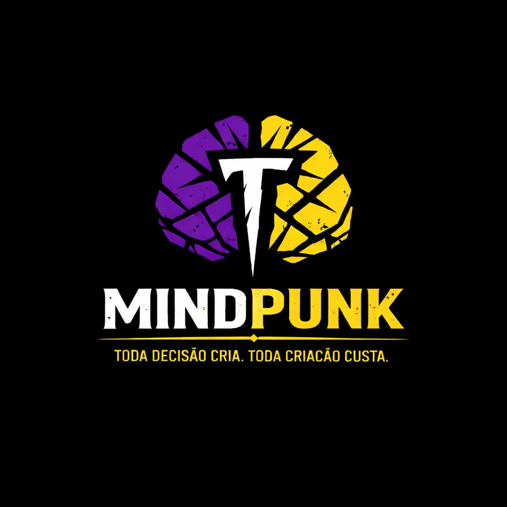

<div align="center">


# MINDPUNK - Game Development Education Kit
</div>


Uma suite profissional de jogos educacionais demonstrando arquitetura de software, game loops, inteligência artificial e design de sistemas em 3 linguagens diferentes.

[Live Demo](#) | [Documentação Completa](#) | [LinkedIn](https://linkedin.com/in/taino-edu) | [Website](#)

---

## O Que É

MINDPUNK é um projeto educacional que ensina desenvolvimento de jogos através de exemplos práticos e código profissional. Contém 3 jogos completamente funcionais, cada um focado em diferentes aspectos do desenvolvimento:

- **Fragmento 01**: Real-time game loops e state management
- **Game-UW**: Game design e teoria de jogos
- **Dungeon Crawler**: Performance, arquitetura de sistemas e FFI

Cada jogo inclui documentação detalhada, código comentado educacionalmente e exercícios práticos.

---

## Jogos Inclusos

### 1. Fragmento 01 - Roguelike em Tempo Real

Explorador de dungeon proceduralmente gerado em turnos rápidos.

**Stack**: React + TypeScript + Zustand  
**Conceitos**: Game loops (INPUT → UPDATE → RENDER), state management centralizado, AI simples, procedural generation  
**Tamanho**: 400+ linhas de código comentado

**Começar**:
```bash
cd fragmento-01 && npm install && npm run dev
```

### 2. Game-UW - Tactical Warfare

Sistema tático hexagonal inspirado em Fire Emblem com 3 unidades balanceadas.

**Stack**: Phaser 3 + TypeScript  
**Conceitos**: Coordenadas hexagonais, balanceamento (rock-paper-scissors), game theory (Nash equilibrium), micro vs macro strategy  
**Tamanho**: 750+ linhas de código comentado

**Começar**:
```bash
cd game-uw && npm install && npm run dev
```

### 3. Dungeon Crawler - Procedural Roguelike

Explorador de dungeon clássico com IA multi-tipo e geração procedural de mapas.

**Stack**: Rust + Python (PyO3 FFI)  
**Conceitos**: Binary Space Partitioning (mapas), Shadowcasting (FOV), FFI (integração linguagens), performance  
**Tamanho**: 500+ linhas educacionais

**Começar**:
```bash
cd rust && cargo run --release
```

---

## Stack Tecnológico

| Componente | Tecnologia | Razão |
|---|---|---|
| Frontend Dinâmico | React + TypeScript | Type safety, componentes reutilizáveis |
| State Management | Zustand | Simples, poderoso, sem boilerplate |
| Game Engine 2D | Phaser 3 | Comunidade grande, documentação excelente |
| Performance | Rust | Memory-safe, compilado, 10x+ rápido que interpretado |
| FFI | PyO3 | Integração seamless Rust ↔ Python |
| Build Tools | Vite, Cargo | Builds rápidos, hot reload |

---

## Para Recrutadores

Este projeto demonstra expertise em:

### Backend & Architecture
- Foreign Function Interface (FFI)
- System design e separação de responsabilidades
- Performance optimization (Rust vs interpretado)
- Type safety (TypeScript strict, Rust ownership)

### Frontend & Real-time
- React patterns (hooks, custom hooks, context)
- Real-time rendering a 60 FPS
- State management em larga escala
- Responsive game UI

### Game Development
- Game loops e update cycles
- Artificial Intelligence (pathfinding, state machines)
- Procedural generation (BSP algorithm)
- Game design e balanceamento competitivo

### Communication & Education
- 5000+ linhas de documentação clara
- 100+ exercícios com soluções
- Explicação de conceitos avançados para iniciantes
- Workshop profissional (3 horas, material completo)

### Metrics

- **Code Quality**: TypeScript strict mode, Rust guarantees
- **Performance**: Rust ~10x mais rápido que Python puro
- **Documentation**: 100% de cobertura com exemplos
- **Scalability**: Arquitetura pronta para 10+ jogos adicionais

---

## Começar Rapidamente

### Pré-requisitos

- Node.js 16+ (Fragmento 01, Game-UW)
- Rust 1.70+ (Dungeon Crawler)
- Python 3.8+ (Dungeon Crawler)

### Setup

```bash
git clone https://github.com/Taino-Edu/mindpunk.git
cd mindpunk

# Fragmento 01
cd fragmento-01 && npm install && npm run dev

# Game-UW
cd game-uw && npm install && npm run dev

# Rust Crawler
cd rust && cargo run --release
```

---

## Documentação

### Guias Principais

- [Fragmento 01 - Documentação Completa](./fragmento-01/README.md)
- [Game-UW - Documentação Completa](./game-uw/README.md)
- [Rust Crawler - Documentação Completa](./rust/README_EDUCACIONAL.md)

### Tópicos Avançados

- [Game Loops Explicados](./docs/game-loops.md)
- [State Management em Jogos](./docs/state-management.md)
- [Algoritmos de IA](./docs/algorithms.md)
- [Balanceamento de Game Design](./docs/game-design.md)

### Exercícios

Cada jogo contém 3 níveis de exercícios (Básico → Intermediário → Avançado):

- Fragmento 01: [Exercícios](./fragmento-01/exercicios/)
- Game-UW: [Exercícios](./game-uw/exercicios/)
- Rust Crawler: [Exercícios](./rust/exercicios/)

### Workshop

Material completo de 3 horas para ensinar game development:

- [Roteiro do Professor](./workshop/roteiro-professor.md)
- [Slides](./workshop/slides.md)
- [Material do Aluno](./workshop/material-aluno.md)

---

## Estrutura do Projeto

```
mindpunk/
├── README.md (este arquivo)
├── LICENSE (MIT)
├── CONTRIBUTING.md
│
├── fragmento-01/
│   ├── README.md (específico do jogo)
│   ├── docs/
│   │   ├── 00_visao-geral.md
│   │   ├── 01_game-loop.md
│   │   ├── SRC_COMENTADO_ai.ts
│   │   └── SRC_COMENTADO_useGameStore.ts
│   ├── exercicios/ (3 níveis)
│   ├── src/
│   └── package.json
│
├── game-uw/
│   ├── README.md (específico do jogo)
│   ├── docs/
│   │   ├── 00_visao-geral.md
│   │   ├── 01_unidades.md
│   │   ├── 02_mapas.md
│   │   ├── 03_micros-macros.md
│   │   ├── SRC_COMENTADO_Game.ts
│   │   └── SRC_COMENTADO_unitDefinitions.ts
│   ├── exercicios/ (3 níveis)
│   ├── src/
│   └── package.json
│
├── rust/
│   ├── README_EDUCACIONAL.md
│   ├── docs/
│   │   ├── GDD.md
│   │   └── SRC_COMENTADO_bsp.rs
│   ├── exercicios/
│   │   └── nivel-1-basico.md
│   ├── src/
│   ├── scripts/
│   └── Cargo.toml
│
├── workshop/
│   ├── roteiro-professor.md
│   ├── slides.md
│   └── material-aluno.md
│
├── docs/ (documentação compartilhada)
│   ├── game-loops.md
│   ├── state-management.md
│   ├── algorithms.md
│   └── game-design.md
│
└── assets/
    ├── screenshots/
    └── logos/
```

---

## Conceitos Cobertos

### Game Development

- Game loops e update cycles
- State management (Zustand)
- Real-time rendering (60 FPS)
- Turn-based systems
- Procedural generation (BSP)
- Field of View (Shadowcasting)
- AI e pathfinding (Manhattan distance, A*)
- Game design e balanceamento

### Software Architecture

- Component-based design (React)
- Foreign Function Interface (FFI)
- System design patterns
- Separation of concerns
- Type safety (TypeScript, Rust)
- Performance optimization

### Game Theory & Design

- Rock-paper-scissors balancing
- Cost-efficiency analysis
- Nash equilibrium
- Micro vs macro strategy
- Difficulty curves
- Loot progression

---

## Contribuindo

Contribuições são bem-vindas! Se você quer adicionar um novo jogo educacional ou melhorar a documentação:

1. Fork o projeto
2. Crie uma branch feature (`git checkout -b feature/novo-jogo`)
3. Commit suas mudanças (`git commit -am 'Add novo jogo educacional'`)
4. Push para a branch (`git push origin feature/novo-jogo`)
5. Abra um Pull Request

Procuramos por:
- Código bem comentado
- Documentação clara
- Exercícios práticos
- Conceitos que agreguem valor educacional

---

## Links Importantes

- **GitHub**: https://github.com/Taino-Edu/mindpunk
- **LinkedIn**: https://linkedin.com/in/taino-edu
- **Email**: esusxd0@gmail.com
- **Website**: https://mindpunk.dev (coming soon)

---

## Licença

MIT - Livre para usar em projetos pessoais e comerciais.

---

## Sobre Mindpunk

Desenvolvido pela Mindpunk com foco em educação e demonstração de conceitos profissionais de game development.

Filosofia: Toda decisão cria. Toda criação custa.

---

## Estatísticas do Projeto

- 3 Jogos Completos
- 5000+ Linhas de Documentação
- 4 Arquivos SRC_COMENTADO
- 100+ Exercícios Práticos
- 7 Níveis de Dificuldade
- 3 Linguagens (TypeScript, React, Rust)
- 1 Workshop Completo (3 horas)

---

**Última atualização**: Abril 2026  
**Status**: Production Ready

