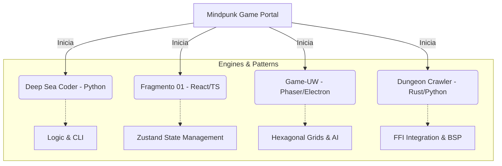

<p align="center">
  
</p>

<h1 align="center">MINDPUNK LAB</h1>
<p align="center">
  <b>"Onde o código encontra a criação. Onde a lógica encontra o jogo."</b>
</p>

<p align="center">
  
  
  
  
</p>

---

<p align="center">
  <a href="#quem-somos--nosso-propósito">Propósito</a> •
  <a href="#-game-portal-início-rápido">Game Portal</a> •
  <a href="#a-jornada-do-desenvolvedor-roadmap">Roadmap</a> •
  <a href="#-visão-profissional--arquitetura">Arquitetura</a> •
  <a href="#como-contribuir-guia-de-colaboração">Contribuir</a>
</p>

---

## Quem Somos & Nosso Propósito

O **Mindpunk Lab** não é apenas um repositório de código; é um laboratório de engenharia focado em democratizar o desenvolvimento de jogos de alta complexidade. Nossa missão é transformar entusiastas em engenheiros, ensinando não apenas como "fazer o código rodar", mas como arquitetar sistemas que escalam, performam e divertem.

**"Toda decisão cria. Toda criação custa."** – Este é o nosso mantra. No desenvolvimento de jogos, cada linha de código é um trade-off entre performance e experiência. Aqui, ensinamos você a dominar esses custos.

---

## Agradecimento Especial: UNIP

Este Starter Kit e os workshops associados não seriam possíveis sem o apoio institucional da **UNIP (Universidade Paulista)**. 

Agradecemos aos coordenadores, professores e alunos da UNIP pelo espaço de experimentação e por acreditarem no potencial da educação técnica através da criação de jogos. Este repositório é fruto dessa colaboração entre a academia e a prática do mercado.

---

## 🎮 Game Portal (Início Rápido)

O Mindpunk Lab possui um lançador centralizado. Para iniciar qualquer jogo, basta rodar o comando abaixo na raiz do projeto ou clicar no arquivo `start.bat`:

```bash
python portal.py
```

---

## A Jornada do Desenvolvedor (Roadmap)

Escolha o seu ponto de entrada e suba de nível na nossa trilha educacional:

| Nível | Projeto | Foco Técnico | Dificuldade |
| :--- | :--- | :--- | :--- |
| **01** | [Deep Sea Coder](./jogos-exemplos/terminal/workshop-deep-sea-coder/) | Lógica Pura & Algoritmos (Python) | Básico |
| **02** | [Fragmento 01](./jogos-exemplos/mindpunk-fragment-01/) | State Management & Web Loops (React) | Intermediário |
| **03** | [Game-UW](./jogos-exemplos/express/Game-UW/) | Game Theory & Hex Grids (Phaser 3) | Avançado |
| **04** | [Dungeon Crawler](./jogos-exemplos/rust/) | Performance & FFI (Rust + Python) | Especialista |

---

## 🏛️ Visão Profissional & Arquitetura

Abaixo, o mapeamento técnico de como o laboratório está estruturado:


```mermaid
graph TD
    A[Mindpunk Game Portal] -->|Inicia| B(Deep Sea Coder - Python)
    A -->|Inicia| C(Fragmento 01 - React/TS)
    A -->|Inicia| D(Game-UW - Phaser/Electron)
    A -->|Inicia| E(Dungeon Crawler - Rust/Python)

    subgraph "Engines & Patterns"
    B -.-> B1[Logic & CLI]
    C -.-> C1[Zustand State Management]
    D -.-> D1[Hexagonal Grids & AI]
    E -.-> E1[FFI Integration & BSP]
    end
```

Este Starter Kit demonstra domínio em:
- **Interoperabilidade:** Integração Rust/Python via FFI.
- **Sistemas Procedurais:** Geração de mapas via algoritmos BSP.
- **Arquitetura Web:** Hooks customizados e gerenciamento de estado atômico.
- **Documentação:** Estrutura de GDD e roteiros pedagógicos de alto nível.

---

## Como Contribuir (Guia de Colaboração)

Quer deixar sua marca no Mindpunk Lab? Adoramos novas ideias! Siga o guia abaixo:

*   **Boas-vindas:** Se você é novo, comece lendo nossos `SRC_COMENTADO` para entender nosso estilo.
*   **Sugestões:** Tem uma ideia de mecânica? Abra uma Issue no GitHub.
*   **Mão na Massa:**
    1.  Faça um Fork do projeto.
    2.  Crie sua Branch (`git checkout -b feature/minha-ideia`).
    3.  Faça o Push e abra um Pull Request.
*   **Desafios Sênior:** Tente resolver um dos desafios nível 3 em qualquer jogo e envie seu código!

---

## Conecte-se Conosco

<div align="center">

[](https://linkedin.com/in/edu-taino)
[](https://github.com/Taino-Edu)
[](https://mindpunk.dev)

</div>

---

**Criado com carinho por Taino-Edu.**  
*Mindpunk Lab - Onde o código encontra a criação.*
